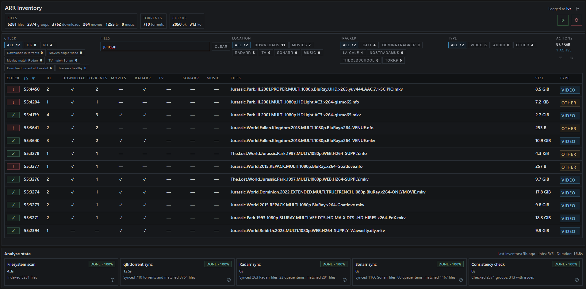

# ARR inventory

> Disclaimer: this project was vibe coded. Treat it as a useful tool built pragmatically, and review the code and behavior before relying on it in a critical environment.

Read-only web app to inventory torrents and media files across an ARR stack.

## Context

This project scans a hardlink-based media layout and exposes a web UI to inspect what is present across:

- downloads files
- movies files
- TV files
- qBittorrent torrents
- Radarr entries
- Sonarr entries

The application is intentionally read-only. It helps identify mismatches and suspicious states without deleting, moving, or renaming files.


## Preview



## Rules

Each analysis run executes these jobs in order:

1. Filesystem scan
2. qBittorrent sync
3. Radarr sync
4. Sonarr sync
5. Consistency check

The consistency step stores rule results per hardlink group. Current rules are:

- `Downloads in torrents`: every file under `/data/downloads` for a group must match a qBittorrent file.
- `Movies single video directory`: inside `/data/media/movies`, one group cannot contain multiple video files in the same movie directory.
- `Movies match Radarr`: movie files must match imported Radarr entries, and imported Radarr entries for the group must point to movie files.
- `TV match Sonarr`: TV files must match imported Sonarr entries, and imported Sonarr entries for the group must point to TV files.
- `Download torrent still useful`: if a group only exists in downloads and all matched torrents exceed the configured seed time and ratio thresholds, the group is marked as not useful anymore.
- `Trackers healthy`: if any active tracker attached to a matched torrent reports an error state or message, the group is marked as failed.

Group status is shown as:

- `Pending`: checks have not run yet for that group
- `OK`: all applicable rules passed
- `KO`: at least one applicable rule failed

## Quick Start

1. Copy `.env.example` to `.env`.
2. Set at least `ADMIN_USERNAME`, `ADMIN_PASSWORD`, and `HOST_DATA_ROOT`.
3. Start the app with `docker compose up -d`.
4. Open `http://localhost:8000`.

Expected media layout inside the mounted data root:

```text
/data/downloads
/data/media/movies
/data/media/tv
```

This layout matters for hardlink-aware grouping.

If needed, you can override these defaults with `DOWNLOADS_PATH`, `MOVIES_PATH`, and `TV_PATH`.

## Environment Variables

Required or commonly used variables from `.env`:

- `HOST_DATA_ROOT`: host path mounted read-only into the container
- `DOCKER_DATA_ROOT`: path used inside the container, usually `/data`
- `DOWNLOADS_PATH`: downloads path inside the container, default `/data/downloads`
- `MOVIES_PATH`: movies path inside the container, default `/data/media/movies`
- `TV_PATH`: TV path inside the container, default `/data/media/tv`
- `ADMIN_USERNAME`: login for the web UI
- `ADMIN_PASSWORD`: password for the web UI
- `QBITTORRENT_URL`: qBittorrent Web API base URL
- `QBITTORRENT_USERNAME`: qBittorrent username
- `QBITTORRENT_PASSWORD`: qBittorrent password
- `TORRENT_MIN_SEED_TIME_DAYS`: seed time threshold used by the usefulness rule
- `TORRENT_MIN_RATIO`: ratio threshold used by the usefulness rule
- `RADARR_URL`: Radarr base URL
- `RADARR_API_KEY`: Radarr API key
- `SONARR_URL`: Sonarr base URL
- `SONARR_API_KEY`: Sonarr API key

Notes:

- The container stores its SQLite database in a dedicated Docker volume.
- The mounted media path is read-only.
- qBittorrent, Radarr, and Sonarr integration can be left empty, but related rules and enrichments will then be limited.

## More Docs

Technical documentation for architecture, local development, build, test, and frontend workflow is available in `docs/DEVELOPMENT.md`.
